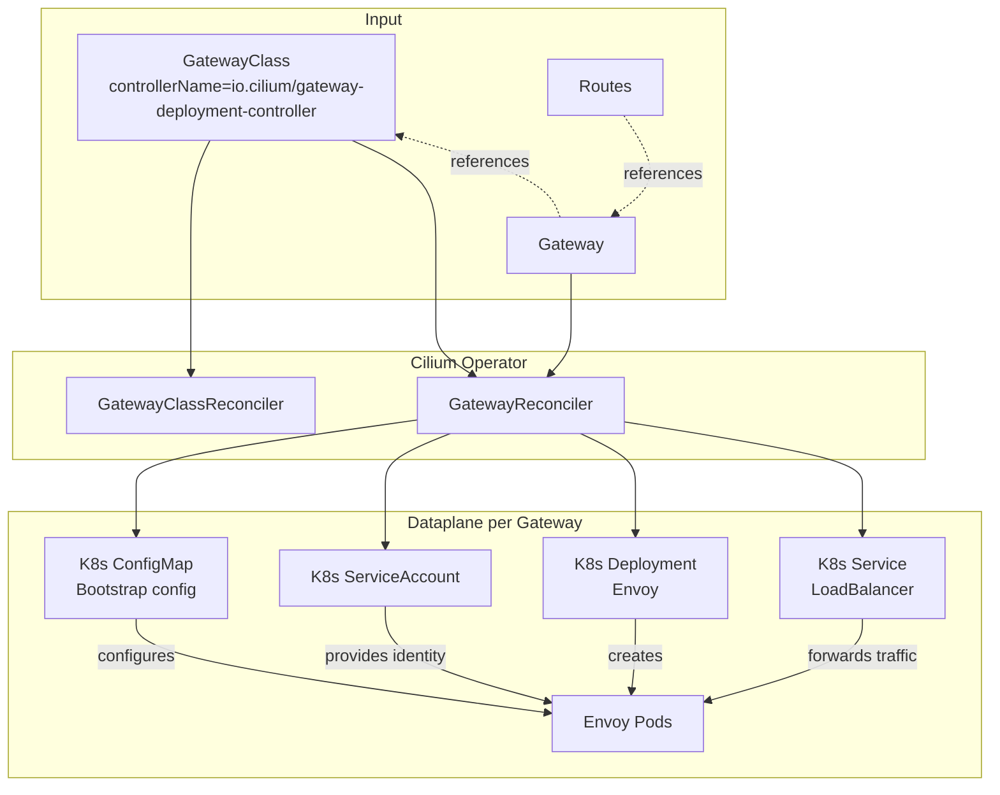

# Per-Gateway Envoy Deployment Gateway API Implementation

This package contains the enterprise Gateway API implementation that manages
dedicated per-`Gateway` infrastructure.

It is separate from the OSS Gateway API implementation and is selected through
a `GatewayClass` whose `spec.controllerName` matches `io.cilium/gateway-deployment-controller`

## Overview

For each managed `Gateway`, a separate control- (Envoy xDS server K8s Deployment)
and dataplane (Envoy K8s Deployment) reconciles.

## Control Model

Reconcilers in this package:

- `GatewayClassReconciler`
  - validates ownership of matching `GatewayClass` objects
  - sets `GatewayClass` accepted status

- `GatewayReconciler`
  - watches `Gateway`
  - watches referenced `GatewayClass`
  - creates and updates the per-`Gateway` dataplane resources
  - deletes managed resources when a `Gateway` no longer belongs to this controller
  - sets the custom `Gateway` status condition `io.cilium/DataplaneReady`
  - preserves unrelated `Gateway` status conditions owned by other controllers such as the xDS controlplane controller

### Dataplane

For a managed `Gateway`, the Gateway reconciler creates these dataplane resources:

- `ConfigMap`
  - contains the embedded Envoy bootstrap config

- `ServiceAccount`
  - provides a dedicated pod identity for the per-`Gateway` dataplane

- `Deployment`
  - runs two Envoy pod replicas by default
  - uses the dedicated dataplane `ServiceAccount`
  - starts `cilium-envoy` directly (no use of `cilium-envoy-starter`)
  - uses Envoy admin `/ready` for probes

- `Service`
  - type `LoadBalancer`
  - listener ports are derived from `Gateway.spec.listeners`
  - selects the Envoy pods for that `Gateway`
