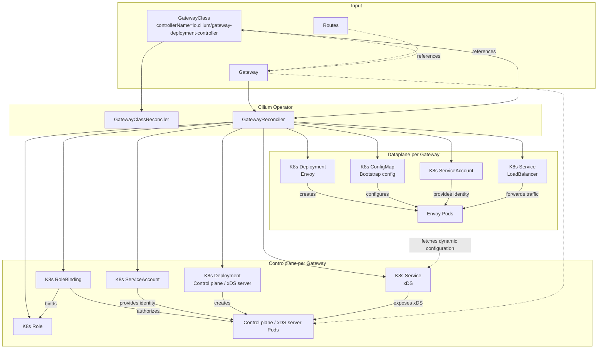

# Per-Gateway Envoy Deployment Gateway API Implementation

This package contains the enterprise Gateway API implementation that manages
dedicated per-`Gateway` infrastructure.

It is separate from the OSS Gateway API implementation and is selected through
a `GatewayClass` whose `spec.controllerName` matches `io.cilium/gateway-deployment-controller`

## Overview

For each managed `Gateway`, a separate control- (Envoy xDS server K8s Deployment)
and dataplane (Envoy K8s Deployment) reconciles.

## Control Model

Reconcilers in this package:

- `GatewayClassReconciler`
  - validates ownership of matching `GatewayClass` objects
  - sets `GatewayClass` accepted status

- `GatewayReconciler`
  - watches `Gateway`
  - watches referenced `GatewayClass`
  - creates and updates the per-`Gateway` dataplane and controlplane resources
  - deletes managed resources when a `Gateway` no longer belongs to this controller
  - sets the custom `Gateway` status conditions `io.cilium/DataplaneReady` and `io.cilium/ControlplaneReady`
  - removes Cilium-owned custom `Gateway` status conditions on handoff
  - preserves unrelated `Gateway` status conditions owned by other controllers such as the xDS controlplane controller

- `gateway-api-controlplane`
  - watches the target `Gateway`
  - serves xDS for the per-`Gateway` Envoy dataplane
  - sets the standard `Gateway` status conditions `Accepted` and `Programmed`
  - relies on the operator-owned custom conditions to determine whether the `Gateway` still belongs to this implementation

### Dataplane

For a managed `Gateway`, the Gateway reconciler creates these dataplane resources:

- `ConfigMap`
  - contains the embedded Envoy bootstrap config

- `ServiceAccount`
  - provides a dedicated pod identity for the per-`Gateway` dataplane

- `Deployment`
  - runs two Envoy pod replicas by default
  - uses the dedicated dataplane `ServiceAccount`
  - starts `cilium-envoy` directly (no use of `cilium-envoy-starter`)
  - uses Envoy admin `/ready` for probes

- `Service`
  - type `LoadBalancer`
  - listener ports are derived from `Gateway.spec.listeners`
  - selects the Envoy pods for that `Gateway`

### Controlplane

For a managed `Gateway`, the Gateway reconciler creates these controlplane resources:

- `ServiceAccount`
  - provides a dedicated pod identity for the per-`Gateway` controlplane

- `Role`
  - grants namespaced read access to the managed `Gateway`
  - later also covers namespaced Route reads
  - cannot be restricted via `ResourceNames`, because the controller-runtime cache uses informer `list` and `watch`

- `RoleBinding`
  - binds the controlplane `ServiceAccount` to the namespaced `Role`

- `Deployment`
  - runs two `gateway-api-controlplane` pod replicas by default
  - passes the target `Gateway` namespace and name as flags
  - serves xDS, health, and metrics endpoints
  - does not use leader election today, because each replica maintains its own local xDS state and must be able to serve the dataplane through the shared `Service`
  - this means replicas may race on identical `Gateway` status updates, but avoids exposing follower replicas that cannot serve xDS

- `Service`
  - type `ClusterIP`
  - exposes the xDS gRPC endpoint to the dataplane Envoy pods

The controlplane stays namespaced-only. It does not read `Namespace` or
`GatewayClass` objects directly. Instead, it relies on the operator-owned custom
conditions `io.cilium/DataplaneReady` and `io.cilium/ControlplaneReady` to
determine whether the `Gateway` still belongs to this deployment-based
implementation. The operator removes its custom conditions during handoff,
which triggers one last controlplane reconcile via the `Gateway` update and
lets the controlplane clear its xDS snapshot without requiring cluster-scoped
RBAC.
